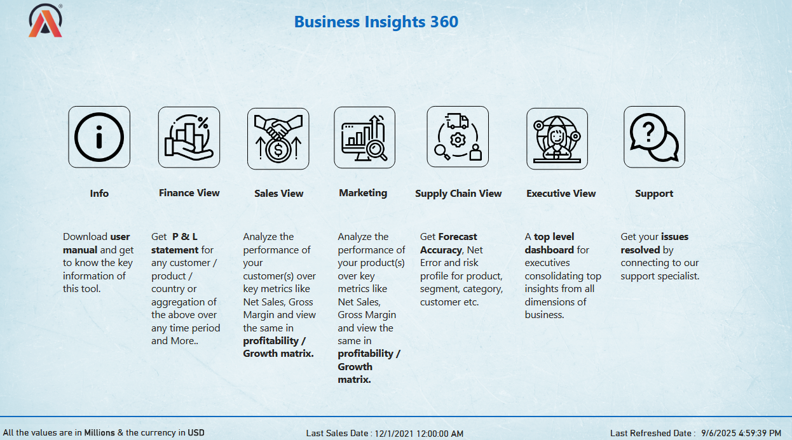
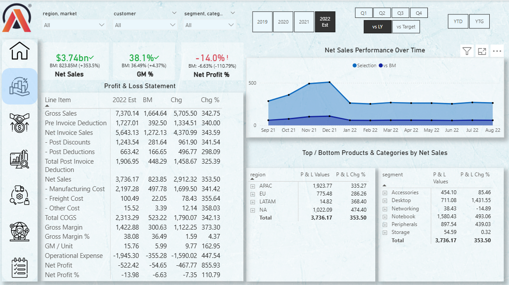
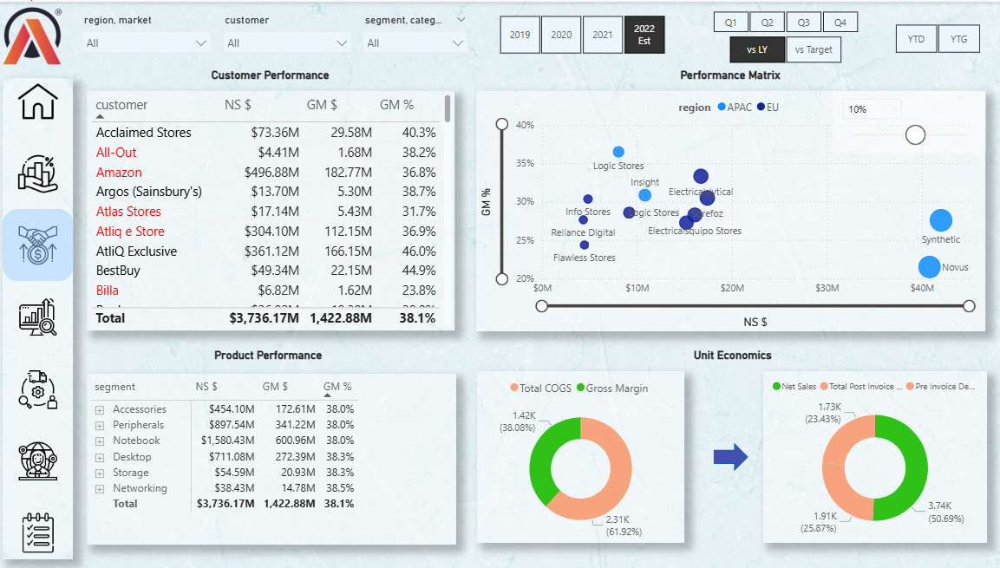
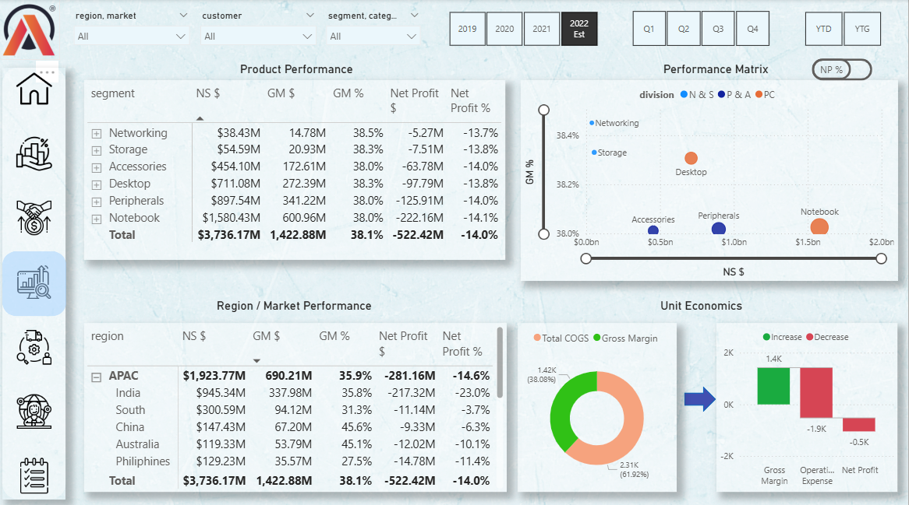
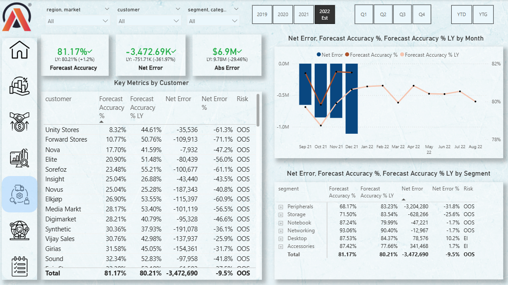
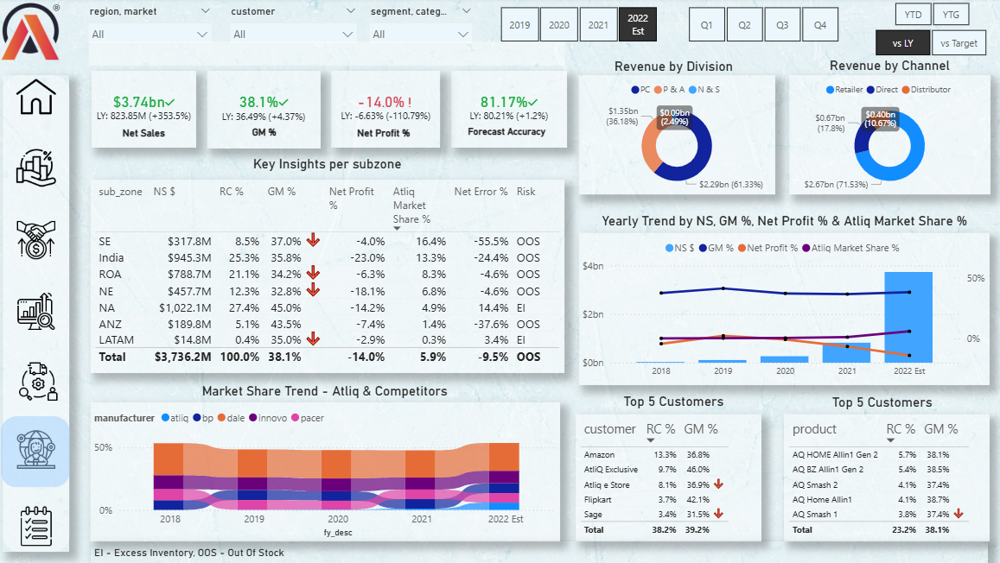

# 🧠 Business Insights 360

🔗 **View the interactive Power BI dashboard here:**  
👉 [Live Dashboard](https://app.powerbi.com/view?r=eyJrIjoiOGFjZWQxYjItOGUwMS00ZjBjLTk4MjctZmMzMGY0NTVjNzI1IiwidCI6ImM2ZTU0OWIzLTVmNDUtNDAzMi1hYWU5LWQ0MjQ0ZGM1YjJjNCJ9)

### 🚀 End-to-End Power BI Project

**Business Insights 360** is a comprehensive Power BI dashboard designed to deliver a unified, 360° view of key business performance metrics across **Sales, Finance, Marketing, Supply Chain, and Executive Management**.  
The project enables data-driven decision-making through interactive visuals and insightful KPIs.

---

## 📊 Project Overview

The **Business Insights 360 Dashboard** provides a consolidated analysis of the company’s performance across multiple business dimensions.  
It empowers decision-makers to explore data across regions, customers, products, and time — and uncover actionable insights in real time.

---

## 📄 Report Preview

---

### 💡 Key Objectives
- Create an **executive-level business overview** with drill-down capabilities.
- Analyze **Net Sales**, **Gross Margin**, **Forecast Accuracy**, and **Net Profit**.
- Enable **regional, customer, and product-level performance tracking**.
- Provide **data-driven insights** for strategic decisions across departments.

---

## 🧾 Key Insights

### 📈 Sales & Finance
- Track **Gross Sales, Deductions, Net Sales, and Gross Margin %** over time.
- Compare actual performance vs. baseline or previous year.
- Identify top-performing **regions, segments, and customers**.

### 📦 Supply Chain
- Assess **Forecast Accuracy, Net Error, and Risk (OOS/EI)** by product, region, and segment.
- Detect underperforming products or high-risk inventory areas.

### 📊 Executive View
- Consolidated KPIs across functions for high-level business health.
- View **P&L summaries** and trends by fiscal year and quarter.

---

## 🧠 Business Impact
- Reduced manual reporting efforts by **70%** through Power BI automation.
- Improved forecast visibility and demand planning.
- Enhanced decision-making via self-service analytics and real-time dashboards.

---

## 🛠 Tools & Technologies

| Tool | Purpose |
|------|----------|
| **Power BI Desktop** | Data modeling, visualization, DAX measures |
| **Excel / CSV Data** | Raw data input sources |
| **Git & GitHub** | Version control and portfolio hosting |
| **Git LFS (Large File Storage)** | Manages large PBIX and PDF files |

---

## 📁 Project Files

| File | Description |
|------|--------------|
| `business_insights_360.pbix` | Main Power BI project file |
| `business_insights_360.pdf` | Static exported report (read-only view) |
| `.gitattributes` | LFS tracking configuration for large files |
| `.gitignore` | Excludes unnecessary backup and temp files |

---

## 👩‍💻 Author
Vickneswari
📍 Power BI Developer | Data Analyst Enthusiast
🔗 [LinkedIn Profile](https://www.linkedin.com/in/vickneswarir) 

